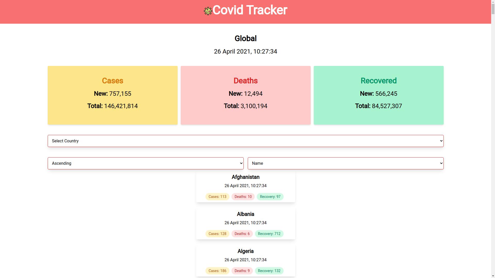

# covid-tracker



## API
- This project uses the [covid19api.com](https://covid19api.com/) by [Kyle Redelinghuys](https://twitter.com/ksredelinghuys)
- [Postman collection](https://documenter.getpostman.com/view/10808728/SzS8rjbc)

## Inspiration
This project is inspired by [Brad traversy's](https://twitter.com/traversymedia) youtube [tutorial](https://youtu.be/m-MAIpnH9ag).
You can check the github repo [here](https://github.com/bradtraversy/vue-covid-tracker)

## Project setup
```
yarn install
```

### Compiles and hot-reloads for development
```
yarn serve
```

### Compiles and minifies for production
```
yarn build
```

### Customize configuration
See [Configuration Reference](https://cli.vuejs.org/config/).

## Pending
- Filter country based on country code and cases, deaths and recovered counts in ascending or descending order.
- Implement graph using D3.js, by taking inspiration from [here](https://www.covid19india.org/).
